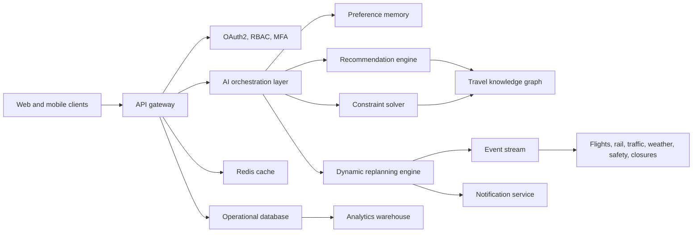
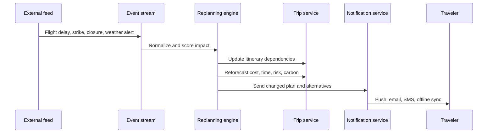

# VoyageOS Travel Planning & Experience Engine

## Product Vision

VoyageOS is an AI travel concierge that supports the full trip lifecycle: discovery, planning, booking support, in-trip operations, disruption recovery, budget control, safety monitoring, offline continuity, and post-trip learning. The core promise is simple: travelers describe what they want, and the system continuously adapts the trip around preferences, constraints, real-world events, and feedback.

## Personas

- Solo travelers: safety-aware routing, social experiences, late-arrival support.
- Couples: shared preferences, memorable stays, flexible meal and experience slots.
- Families: child-friendly pacing, short transfers, medical and emergency readiness.
- Friend groups: voting, budget balancing, conflicting interest resolution.
- Business travelers: meeting buffers, expense capture, transfers, policy compliance.
- Luxury travelers: premium inventory, private guides, upgrades, concierge escalation.
- Backpackers: low-cost stays, public transit, flexible dates, local discovery.
- Digital nomads: Wi-Fi reliability, coworking, longer-stay logistics.
- Senior citizens: low walking load, accessible transfers, health support.
- Accessibility-focused travelers: step-free routes, verified accessibility metadata, assistance contacts.

## User Flows

1. Conversational intake: user enters a natural-language request such as "wheelchair-accessible vegan food trip to Japan under $3000."
2. Preference capture: the engine extracts destination, budget, dates, traveler type, dietary needs, accessibility, safety, pace, accommodation, and transport preferences.
3. Trip generation: destination ranking, route selection, day-wise itinerary, hour-aware sequencing, meals, rest periods, backups.
4. Constraint solving: budget, visa, passport, weather, closures, holidays, health, age, language, accessibility, and safety checks.
5. Live operations: monitor flights, rail, traffic, weather, crowding, closures, advisories, strikes, and local emergencies.
6. Self-healing: when disruption occurs, rebook affected activities, adjust check-in and transfers, reforecast budget, notify travelers.
7. Post-trip learning: summarize spend, memories, trip analytics, skipped items, ratings, and future recommendations.

## Information Architecture

- Plan: conversational prompt, structured preferences, destination recommendations.
- Optimize: routes, budget, carbon, risk, accessibility, group consensus.
- Manage: bookings, live signals, emergency support, offline pack.
- Experience: local discovery, hidden gems, meals, festivals, backups.
- Learn: feedback, skipped recommendations, booking behavior, trip history.
- Admin: provider health, audit logs, fraud signals, policy and compliance.

## System Architecture

## Data Model

Core entities:

- User: identity, consent, profile, home region, language, accessibility preferences.
- TravelerProfile: persona, dietary needs, mobility needs, safety preferences, loyalty settings.
- Trip: destination set, dates, budget, reserve, status, risk score, carbon score.
- ItineraryItem: day, time window, activity, location, dependencies, backup item, booking reference.
- RouteOption: legs, transport mode, cost, duration, carbon, accessibility, disruption score.
- Booking: provider, price, refund rules, confirmation, payment token reference.
- LiveEvent: source, severity, location, affected assets, expiry, recommended action.
- FeedbackSignal: rating, skip reason, liked item, behavior event, future weight.
- AuditLog: actor, action, resource, timestamp, policy result.

## API Surface

- `POST /v1/trips/parse-intent`: convert natural language into structured trip intent.
- `POST /v1/trips`: create a trip plan from preferences and constraints.
- `GET /v1/trips/{tripId}`: fetch plan, itinerary, budget, route, risk, and live status.
- `POST /v1/trips/{tripId}/optimize`: rerank routes, activities, cost, carbon, and safety.
- `POST /v1/trips/{tripId}/replan`: apply a disruption and return a self-healed itinerary.
- `POST /v1/trips/{tripId}/feedback`: store ratings, skips, likes, and behavior signals.
- `GET /v1/destinations/recommendations`: rank destinations by budget, weather, safety, season, and interests.
- `GET /v1/events/live`: stream monitored travel events by trip and region.
- `POST /v1/concierge/messages`: answer trip questions with grounded itinerary context.

## Event Flow

## AI Agent Architecture

- Intent agent: extracts structured trip data from conversational requests.
- Preference agent: maintains long-term and trip-specific memory with consent controls.
- Destination agent: ranks destinations by budget, season, safety, events, crowding, and history.
- Itinerary agent: sequences activities by geography, energy, opening hours, meals, and rest.
- Route agent: optimizes time, cost, energy, carbon, traffic, and accessibility.
- Replanning agent: performs dependency-aware trip repair after disruptions.
- Concierge agent: answers local, emergency, translation, navigation, and budget questions.
- Learning agent: updates future recommendation weights from ratings, skips, and bookings.

## Security Model

- OAuth2 and OIDC for authentication.
- RBAC for traveler, group owner, support agent, provider, and admin roles.
- MFA for account, payment, and sensitive itinerary changes.
- TLS everywhere and field-level encryption for sensitive traveler data.
- KMS-backed secret management and tokenized payment references.
- Rate limiting, bot detection, fraud scoring, and abuse monitoring.
- Immutable audit logs for trip changes, support access, provider updates, and policy decisions.
- GDPR controls for consent, export, retention, deletion, and regional data residency.
- SOC2 readiness through change control, incident response, access review, monitoring, and vendor risk management.

## Testing Strategy

- Unit tests: parsers, scoring models, budget math, route ranking, constraint policies.
- Integration tests: APIs, provider adapters, event ingestion, notification delivery.
- End-to-end tests: plan creation, group voting, disruption recovery, offline pack, post-trip summary.
- Load tests: high-traffic planning bursts, event spikes, notification fanout.
- Stress tests: provider latency, cache misses, partial outage, degraded AI model response.
- Security tests: auth bypass, RBAC, injection, rate limits, payment token handling, secrets exposure.
- Accessibility tests: keyboard navigation, screen readers, color contrast, focus states, accessible route labels.
- Chaos tests: missed flights, cancellations, lost luggage, medical emergency, weather disruption, visa rejection, passport loss, payment failure, network outage, border restriction.

## Deployment And Observability

- Frontend on CDN with edge caching and region-aware routing.
- API services on Kubernetes with autoscaling and blue-green deployment.
- Event ingestion through Kafka or managed streaming.
- Redis for hot trip state, provider response caching, and rate-limit counters.
- PostgreSQL for operational data, object storage for offline packs and receipts, warehouse for analytics.
- Observability includes traces, structured logs, SLO dashboards, model quality metrics, provider health, event lag, and notification delivery status.

## Cost Optimization

- Cache stable destination and provider metadata.
- Batch event enrichment and itinerary reoptimization.
- Use smaller models for classification and extraction, larger models only for high-value planning and concierge synthesis.
- Precompute destination rankings by season, region, and traveler segment.
- Apply provider circuit breakers to avoid expensive retry storms.

## Roadmap

1. Prototype: static planner, prompt parsing, simulated live signals, budget forecast, disruption demo.
2. MVP: authenticated trips, real provider integrations, itinerary persistence, notifications.
3. Growth: group voting, offline packs, post-trip summaries, personalization memory.
4. Scale: global event ingestion, multi-region deployment, provider marketplace, enterprise travel policy.
5. Maturity: advanced fraud detection, SOC2 program, predictive disruption avoidance, autonomous booking flows.
